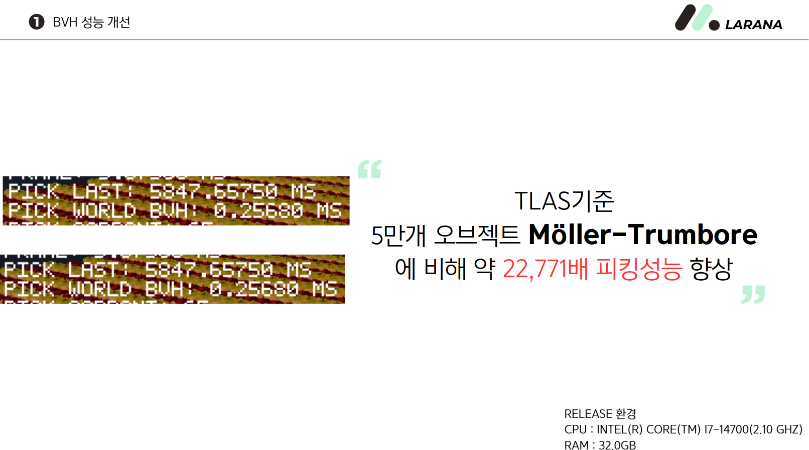
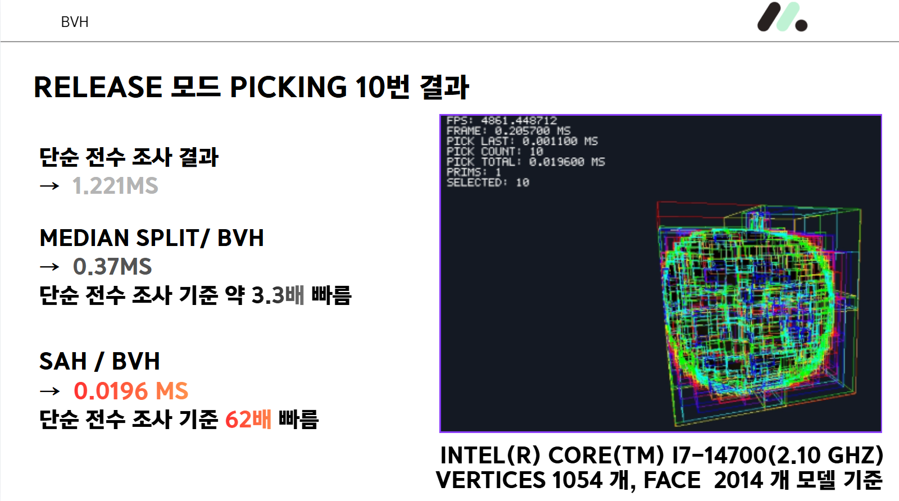
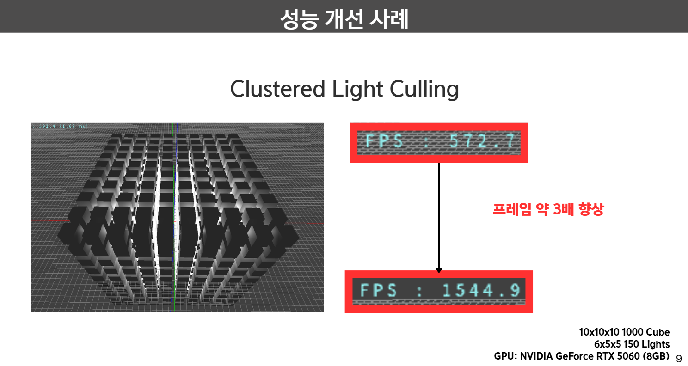

# Week 8 — KraftonEngine

## BVH 성능 개선

객체와 메시의 경계 영역을 계층적으로 묶어, 피킹 시 교차 가능성이 있는 영역만 탐색하도록 했습니다. 아래 결과는 발표 자료에 기록된 측정값이며, 장면 전체 객체 탐색과 단일 모델 내부 탐색은 별도의 실험입니다.

### 1. TLAS — 5만 개 객체 피킹

장면 전체 객체를 대상으로 삼각형 교차 검사를 전수 수행하는 방식과 World BVH를 이용한 탐색을 비교했습니다. Möller–Trumbore는 Ray–삼각형 교차 판정 알고리즘이며, 여기서 비교하는 것은 해당 검사를 전수 수행하는 경로와 BVH로 검사 후보를 줄이는 경로입니다.

| 방식 | 피킹 시간 |
| --- | ---: |
| 전수 검사 | 5,847.6575 ms |
| World BVH | 0.2568 ms |

- 객체 수: 50,000개
- 측정 환경: Release, Intel Core i7-14700 (2.10 GHz), RAM 32 GB
- 제시된 측정값 기준 약 **22,771배** 빠른 피킹

### 2. 메시 BVH — Median Split과 SAH 비교

단일 모델을 대상으로 전수 검사, Median Split BVH, SAH(Surface Area Heuristic) BVH의 피킹 시간을 비교했습니다. SAH는 경계 영역의 표면적과 포함된 요소 수를 이용해 탐색 비용을 고려하는 분할 기준입니다.

| 방식 | 피킹 10회 측정 결과 | 전수 검사 대비 속도 |
| --- | ---: | ---: |
| 전수 검사 | 1.221 ms | 1배 |
| Median Split BVH | 0.37 ms | 약 3.3배 |
| SAH BVH | 0.0196 ms | 약 62배 |

- 측정 환경: Release, Intel Core i7-14700 (2.10 GHz)
- 모델: 정점 1,054개, 면 2,014개
- 발표 자료의 피킹 10회 결과를 기재했으며, SAH 캡처의 `PICK TOTAL`은 0.019600 ms입니다.

## Clustered Light Culling

시야 공간을 3차원 클러스터로 나누고, 각 클러스터에 영향을 주는 광원 목록을 구성해 조명 계산 대상을 줄였습니다.

| 구분 | FPS |
| --- | ---: |
| 개선 전 | 572.7 |
| 개선 후 | 1,544.9 |

- 장면 구성: 큐브 1,000개(10 × 10 × 10), 광원 150개(6 × 5 × 5)
- GPU: NVIDIA GeForce RTX 5060 8 GB
- 제시된 측정값 기준 FPS 약 **2.70배 향상** — 발표 자료에서는 약 3배로 표기

> 위 수치는 첨부된 발표 자료의 실험 조건과 측정 결과를 정리한 것으로, 이번 README 작성 과정에서 벤치마크를 다시 실행한 결과는 아닙니다.
